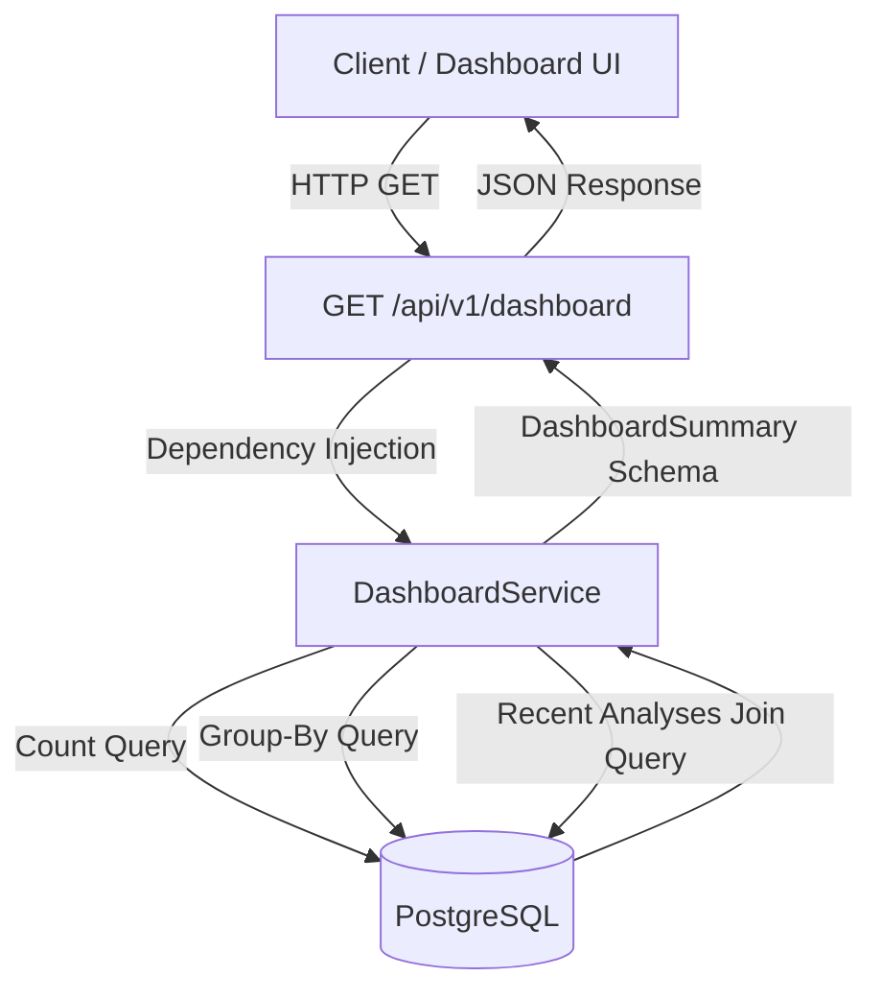

# Dashboard Aggregation Architecture

This document describes the design and query optimizations for the Dashboard summary endpoint.

## Overview

The Dashboard summary endpoint provides a single entry point for a high-level overview of the entire PRPilot platform status. It aggregates total counts, counts broken down by risk levels, and lists the most recent analyses.

## Query Optimization

To keep database queries efficient and minimize latency during live demonstrations, the service reduces the count queries to only 4 basic select statements:

1. **Repository Count**: Counts all repository records.
2. **Pull Request Count**: Counts all pull request records.
3. **Consolidated Risk Level Group-By**: Runs a single query grouping by `Analysis.risk_level` (`LOW`, `MEDIUM`, `HIGH`, `None`). This aggregates total analyses and individual risk level counts in one operation.
4. **Recent Analyses Join**: Fetches the top 5 most recent `Analysis` records, eager-loading related `PullRequest` and `Repository` records using `joinedload` to prevent $N+1$ query issues.

## Serialization

The payload conforms to the `DashboardSummary` Pydantic model:

* Raw database numbers are mapped directly to fields.
* Recent analyses are serialized into `DashboardRecentAnalysis` schemas, translating related join columns (pull request title, repository name) directly to root response attributes for simplified consumption.
