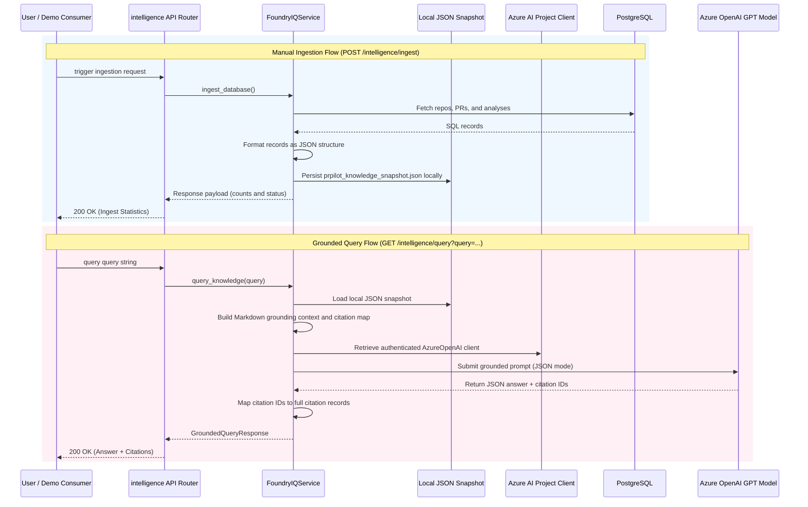

# Microsoft Foundry IQ Integration Architecture (Compatibility Mode)

This document describes the design, setup, and execution flows of the Microsoft Foundry IQ intelligence layer in PRPilot under Compatibility Mode.

## Overview

To guarantee compatibility in Azure AI Foundry regions where Agents and File Search tools are unavailable (such as **Central India**), PRPilot uses a database-grounded local prompt context approach. Grounding context is compiled directly from the synchronized PostgreSQL database records and provided to the Azure OpenAI chat completions model.

## Database Grounding (Local Snapshot)

Rather than uploading files to Azure vector stores or setting up complex search index pipelines:
1. The ingestion endpoint queries the local PostgreSQL database to retrieve all repositories, pull requests, and latest risk analyses.
2. It compiles this information into a structured JSON knowledge base.
3. The snapshot is saved to the local runtime environment (`tempfile.gettempdir()`) as `prpilot_knowledge_snapshot.json`.

## Grounded Retrieval & Citation Mapping

* **Prompt Construction**: Upon querying, the service reads the JSON snapshot, builds a clean structured Markdown description of the data, and assigns a strict citation ID (e.g. `repo_1`, `pr_1_12`) to each entity.
* **Model Inference**: The query is submitted to Azure OpenAI using the `openai_client.chat.completions.create` API with `response_format={"type": "json_object"}`. The system instructions guide the model to answer using *only* the grounding text and cite references using the designated IDs.
* **Graceful Failure**: If the local snapshot has not yet been initialized via ingestion, the service raises a `PRPilotError`, returning a clean HTTP error to the client.
* **Citations Attributions**: The service receives citation IDs back from the model, validates them against the citation registry, appends the repository name, pull request number, and risk levels, and returns the response.
