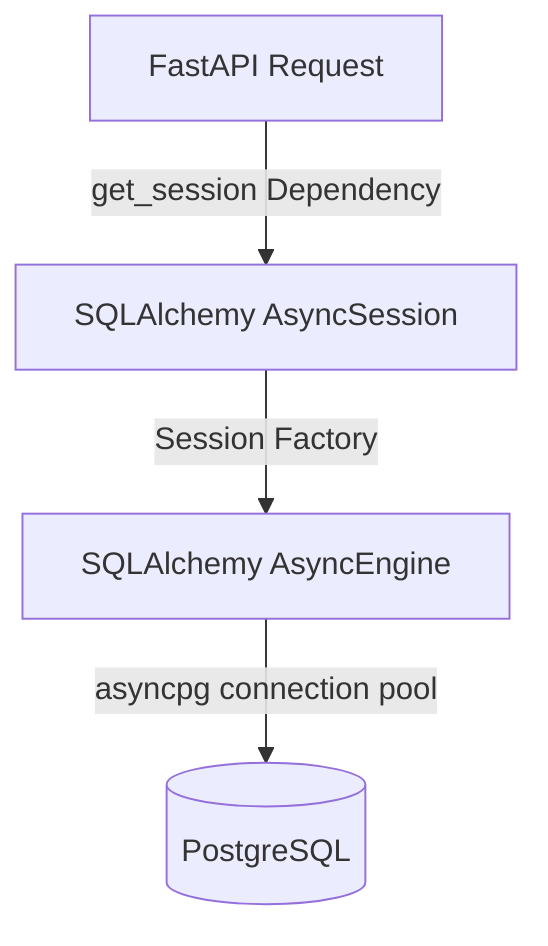

# Persistence Layer Architecture

This document describes the database engine architecture, session lifecycles, migration strategies, and repository conventions for the PRPilot platform.

---

## 1. Engine Architecture

PRPilot implements an asynchronous persistence layer utilizing SQLAlchemy 2.0 with the `asyncpg` PostgreSQL database driver.



### Connection Pool Configuration
* **Async Engine**: Configured using `create_async_engine` inside `app/core/database.py`.
* **Async Driver**: Enforces `postgresql+asyncpg://` schema connections.
* **Typing Verification**: Reads connection strings directly via Pydantic `PostgresDsn` validation to detect incorrect formats before runtime execution.

---

## 2. Session Lifecycle

Database sessions are managed using SQLAlchemy's `AsyncSession` to prevent blocking the asynchronous event loops:

1. **Request Lifecycle**: FastAPI routes inject database connections using the `get_session` dependency.
2. **Context Manager**: A session is created asynchronously when a route starts and is closed automatically when the request finishes.
3. **Commit/Rollback Boundaries**: Transaction boundaries belong in the Service Layer. Transactions are committed or rolled back explicitly within business logic, ensuring that database sessions are returned to the pool cleanly.

---

## 3. Migration Workflow

Schema migrations are managed via **Alembic** using its async template.

### Directory Structure
* `backend/alembic.ini`: Primary migration runner configuration.
* `backend/migrations/env.py`: Database connection environment setup.
* `backend/migrations/script.py.mako`: Template for auto-generating migrations.
* `backend/migrations/versions/`: Contains step-by-step migration versions.

### Execution Commands

All commands are run from the `backend/` directory:

* **Generate Migration**:
  ```bash
  uv run alembic revision --autogenerate -m "description_here"
  ```
* **Upgrade Database**:
  ```bash
  uv run alembic upgrade head
  ```
* **Downgrade Database**:
  ```bash
  uv run alembic downgrade -1
  ```
* **Check Status**:
  ```bash
  uv run alembic current
  ```

---

## 4. Repository Strategy

PRPilot enforces the Repository Pattern to decouple database technology and model details from the business services.

### Repository Interface
* **Base Repository**: Declared in `backend/app/repositories/base.py`.
* **Generic Typing**: Bounded to the abstract `BaseModel` class (`BaseRepository(Generic[ModelType])` where `ModelType = TypeVar("ModelType", bound=BaseModel)`).
* **Session Ownership**: Repositories accept an `AsyncSession` instance on instantiation. They do not open or close sessions themselves.
* **No Database Logic in Controllers**: Direct imports of SQLAlchemy models, queries, or database session objects inside API routes are strictly forbidden. All operations must go through service classes.
