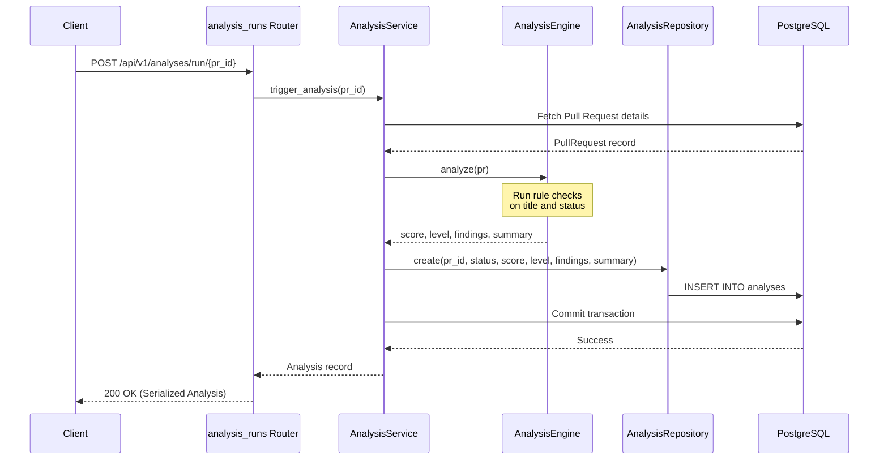

# PR Analysis MVP Architecture

This document describes the architectural design and data flow of the Pull Request Analysis MVP.

## Overview

The PR Analysis layer evaluates synchronized pull requests against a set of deterministic, rule-based checks. It computes a numerical `risk_score` from `0` to `100`, translates that score into a type-safe `RiskLevel` (`LOW`, `MEDIUM`, `HIGH`), collects detailed warning strings (`findings`), and constructs a human-readable `summary`.

No external AI APIs or background workers (like Celery/Redis) are utilized in this phase; execution is synchronous and occurs during the HTTP request lifecycle.



## Deterministic Rule Set & Scoring

The `AnalysisEngine` applies the following rules:

| Finding Description | Trigger Condition | Score Weight |
|---|---|---|
| Work In Progress | "wip" or "draft" in pull request title | +20 |
| Short Title | Title length is less than 10 characters | +15 |
| Very Long Title | Title length is greater than 80 characters | +10 |
| Stale Branch | Status is OPEN and PR opened > 30 days ago | +25 |
| Missing Closure Date | Status is closed/merged but `closed_at` is null | +20 |

* **Risk Score Capping**: The final score is bounded to a range of `[0, 100]`.
* **Merged PR Exception**: Merged PRs do not increase risk score.
* **Risk Level Boundaries**:
  - `LOW`: Score between `0` and `30`
  - `MEDIUM`: Score between `31` and `70`
  - `HIGH`: Score between `71` and `100`

## Database Storage

Analyses are stored in the `analyses` table. We use a custom type-safe Enum (`RiskLevel`) and store list strings (`findings`) in a PostgreSQL `JSON` column to avoid raw string serialization.

```sql
CREATE TYPE risklevel AS ENUM ('LOW', 'MEDIUM', 'HIGH');

ALTER TABLE analyses
  ADD COLUMN risk_level risklevel,
  ADD COLUMN findings JSON;
```

## Future Path: Transitioning to LLM / AI

When transitioning to an AI-based evaluation layer:
1. The `PRAnalysisService` abstract interface contract will remain identical.
2. A new `AIAnalysisService` or `LLMAnalysisService` implementation class will be created.
3. The dependency injection provider `get_analysis_service` in `deps.py` will be modified to inject the new LLM-based service without modifying any endpoint or router code.
4. Calculations will migrate to an asynchronous worker pool (Celery/Redis) with `AnalysisStatus.PENDING` and webhook callbacks to handle AI API latencies.
