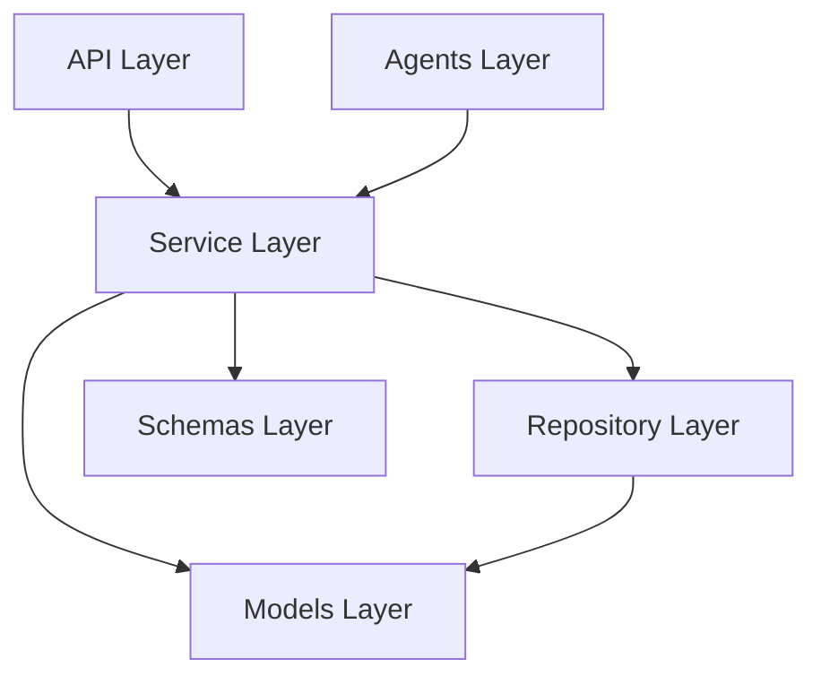

# Project Structure & Architectural Guidelines

This document defines the architecture layout, layer responsibilities, dependency rules, and coding conventions for the PRPilot platform.

---

## 1. Backend Layer Responsibilities

The backend is built as a modular FastAPI application located under `backend/app/`. Each layer has a distinct responsibility.

### API Layer (`backend/app/api/`)
* **Request Handling**: Receives incoming HTTP requests, processes path/query parameters, headers, and request body.
* **Response Generation**: Serializes results into JSON and returns appropriate HTTP status codes.
* **Validation Entry Point**: Leverages Pydantic schemas to validate incoming data structures and reject malformed input before processing.

### Service Layer (`backend/app/services/`)
* **Business Orchestration**: Contains the core business logic, orchestrating multiple repositories, integrations, and agent tasks.
* **Use-Case Execution**: Encapsulates specific domain operations (e.g., triggering a code review pipeline).

### Repository Layer (`backend/app/repositories/`)
* **Data Access Abstraction**: Decouples services from raw database sessions/queries.
* **Database Operations**: Contains querying and transactional database code (e.g., SQLAlchemy queries).

### Models (`backend/app/models/`)
* **Persistence Entities**: Defines structural database models (e.g., SQLAlchemy Declarative Base entities) mapping directly to PostgreSQL tables.

### Schemas (`backend/app/schemas/`)
* **Contracts**: Defines data contracts using Pydantic models for data parsing, validation, serialization, and deserialization.

### Agents (`backend/app/agents/`)
* **AI Review Agents**: Contains LLM/Agent reasoning loops, prompt templates, and tool schemas.
* **Specialized Sub-Agents**: Housing of agent pipelines including Security Agent, Performance Agent, Architecture Agent, and Summary Agent.

---

## 2. Frontend Responsibilities

The frontend is a Next.js web application located under `frontend/`.

* **`app/`**: Next.js App Router folders defining UI routing, layouts, and page structures.
* **`components/`**: Reusable visual components (e.g., buttons, charts, modals) following a consistent styling guideline.
* **`hooks/`**: Custom React hooks for client-side state management, styling, and data fetching behaviors.
* **`services/`**: API client wrappers that facilitate typed REST/GraphQL requests to the backend endpoints.
* **`types/`**: Shared TypeScript definitions, interfaces, and types to guarantee compile-time correctness.
* **`public/`**: Publicly hosted static assets (e.g., logos, icons, fonts).

---

## 3. Dependency Rules

To prevent coupling and circular dependencies, code must respect strict boundaries:



* **API Layer → Service Layer → Repository Layer**: Data flow must move in a clean top-down/outside-in manner.
* **Strict Decoupling**: Repositories must never be imported directly into API routes. All access to the database or persistence layers from API routers must go through the Service Layer.
* **Agent Boundaries**:
  * Agents may depend on Services to fetch context or trigger repository actions.
  * Services must never depend on Agents directly (e.g., to prevent circular references and preserve the synchronous/predictable nature of services).
* **Inward Movement**: Dependency direction must always move inward. Shared schemas, models, and core configuration have no outer dependencies.

---

## 4. Repository Conventions

To maintain a maintainable, clean codebase, we enforce the following conventions:

* **No Business Logic inside Routes**: API router files should only perform validation, route to the service, and handle responses.
* **No Database Access inside Routes**: No database sessions or raw database queries may exist inside API route functions.
* **No Utility Dumping Grounds**: The codebase explicitly bans naming files `misc.py`, `helpers.py`, or `utils.py` to prevent structural erosion. Helper functions must be placed inside contextual namespaces or modules (e.g., `backend/app/core/security.py`).
* **No God Classes**: Break down complex objects and classes into modular, cohesive components with single responsibilities.

---

## 5. Agent Architecture Location

All review agents must be located under:
```
backend/app/agents/
```

Individual files in this directory will encapsulate agent system instructions, prompt orchestration, tools, and execution flows. The core review agents include:
* **SecurityAgent**: Scans pull request diffs for vulnerability patterns, credential leakage, and security risks.
* **PerformanceAgent**: Pinpoints bottlenecks, complexity issues, and optimization opportunities.
* **ArchitectureAgent**: Evaluates code organization against design patterns and modular guidelines.
* **SummaryAgent**: Generates concise, developer-friendly contextual descriptions of pull request modifications.
